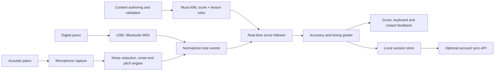

# Piano Practice App — Product and Technical Architecture

## 1. Product goal

Build a mobile-first app that teaches people to play well-known piano music. The app displays the next notes, listens to a real acoustic or digital piano, identifies the keys the learner played, and immediately explains whether the notes, timing, and tuning were correct.

The first version should be dependable rather than overly ambitious:

- Support acoustic piano input through the device microphone.
- Support digital pianos through USB MIDI and Bluetooth MIDI.
- Start with right-hand, one-note-at-a-time practice.
- Add left hand, chords, pedal, rhythm, and full-song score following in later releases.
- Work offline during a practice session.
- Include 100 public-domain-friendly compositions and traditional melodies. Every score/arrangement and recording still needs its own rights check.

## 2. Main user experience

1. The learner chooses a piece and difficulty.
2. The app offers a short lesson, full practice, or a selected measure range.
3. The learner selects microphone or MIDI input.
4. Microphone mode runs a ten-second room and piano calibration.
5. The score pauses at the next expected note or continues at a chosen tempo.
6. The app listens, detects played notes, and aligns them with the score.
7. Notes turn green when correct, amber when early/late, and red when wrong.
8. At the end, the app reports note accuracy, rhythm accuracy, tempo stability, difficult measures, and tuning observations.
9. The next session automatically emphasizes the weakest measures.

## 3. Functional requirements

### Practice and learning

- Browse by title, composer, level, era, skill, and estimated duration.
- Display standard notation, note names, finger numbers, and an optional falling-note view.
- Practice right hand, left hand, or both hands.
- Loop measures, slow the tempo, enable a count-in, and use a metronome.
- Wait Mode: do not advance until the expected notes are played.
- Rhythm Mode: keep moving and grade timing against the beat.
- Listen Mode: play a licensed reference performance or generated MIDI rendition.
- Save bookmarks, goals, streaks, mastery, and per-measure history.

### Input and feedback

- Detect piano notes from microphone audio across A0–C8 when confidence is sufficient.
- Read exact note-on, note-off, velocity, and pedal events from MIDI.
- Allow concert pitch calibration, normally A4 = 440 Hz, from 415–466 Hz.
- Show the detected note, octave, frequency, and cents sharp/flat.
- Grade correct note, missing note, extra note, timing, duration, chord completeness, and tempo.
- Avoid harsh grading when audio confidence is low; ask the learner to replay or move the device.

### Accounts and content

- Guest mode with all core practice features stored locally.
- Optional account for cross-device sync, subscription, and restored purchases.
- Version every score and arrangement so content updates do not corrupt historical results.
- Download lesson packs for offline use.

## 4. Recommended system architecture



### A. Client application

A good reference implementation is Flutter for shared iOS and Android UI, with a small native audio layer. A web client can be added later, but browser audio and MIDI permissions vary enough that mobile should be the quality target.

Client modules:

- `catalog`: search, filters, downloads, favorites, and recently played.
- `score_viewer`: MusicXML rendering, cursor, fingering, note colors, and measure selection.
- `practice_engine`: transport, tempo, count-in, loops, hand selection, and Wait Mode.
- `audio_input`: microphone permission, device routing, gain, and PCM ring buffer.
- `midi_input`: USB/Bluetooth discovery and normalized MIDI events.
- `note_detector`: onset, pitch, chord candidates, confidence, and tuning offset.
- `score_follower`: maps observed events to the most likely position in the expected score.
- `grader`: produces instant feedback and end-of-session metrics.
- `content_store`: downloaded score bundles, validation, and migrations.
- `session_store`: local-first progress, attempts, settings, and pending sync jobs.
- `sync_client`: authenticated upload/download with retry and conflict handling.

### B. Native real-time audio engine

Use the operating system's low-latency audio API: `AVAudioEngine` on iOS and Oboe/AAudio on Android. Process audio outside the UI thread and send only compact note events to the app layer.

Suggested signal pipeline:

```text
48 kHz mono PCM
  -> DC removal and 27.5 Hz high-pass filter
  -> adaptive noise gate from room calibration
  -> onset detector
  -> overlapping analysis frames
  -> harmonic/pitch likelihood for 88 piano keys
  -> temporal smoothing and hysteresis
  -> note-on/note-off events with confidence
  -> tuning-offset estimator
```

Important details:

- A piano note contains a fundamental plus strong harmonics. Do not simply choose the loudest FFT bin.
- Use YIN or a similar autocorrelation method for reliable monophonic pitch in the MVP.
- For chords, use a Constant-Q representation plus harmonic templates or an on-device polyphonic transcription model.
- Use short frames for onset timing and longer overlapping frames for low-note pitch accuracy.
- Maintain a noise profile and reject speech, metronome clicks, and sustain-only energy where possible.
- Emit `uncertain`, not `wrong`, below the confidence threshold.
- Run inference entirely on-device; no raw microphone audio should leave the device by default.

Example normalized event:

```json
{
  "source": "microphone",
  "midiNote": 64,
  "name": "E4",
  "startedAtMs": 12840,
  "endedAtMs": 13490,
  "velocity": 72,
  "frequencyHz": 329.9,
  "centsFromTarget": 1.8,
  "confidence": 0.94
}
```

### C. Score follower and grader

The expected score is a timeline of beat-relative note groups. The follower should not compare only against the single next note because learners pause, repeat, skip, or accidentally add notes.

Maintain a small moving window around the expected position and choose the alignment with the lowest cost:

```text
alignment cost =
    wrong-note penalty
  + missing-note penalty
  + extra-note penalty
  + timing-distance penalty
  + skipped-position penalty
  + low-confidence discount
```

For a chord, compare sets of pitch classes plus octaves within a configurable time window. Do not require every finger to land on the same audio frame. A beginner-friendly chord window of roughly 150–250 ms can be tightened as the learner advances.

Feedback rules:

- **Correct:** expected pitch appears within the timing window.
- **Early/late:** correct pitch, timing outside the target window.
- **Wrong:** high-confidence pitch conflicts with the expected note.
- **Missing:** expected note never appears before the follower advances.
- **Extra:** a high-confidence unscored note appears and is not pedal resonance.
- **Incomplete chord:** only some expected chord notes appear.
- **Uncertain:** the input is too noisy or ambiguous to grade fairly.

The total score should not be a mysterious single number. Show its components:

- Note accuracy: 50%
- Rhythm accuracy: 25%
- Tempo stability: 15%
- Continuity/no restarts: 10%

These weights are product defaults and should be remotely configurable by lesson type.

### D. Content format

Use MusicXML as the editable source of truth. Generate a compact, immutable practice bundle for the client:

```text
piece.json              metadata, rights, levels and content version
score.musicxml          source notation
timeline.json           normalized notes, beats, hands and measure boundaries
pedagogy.json           fingerings, hints, sections and skill tags
preview.mid             synthesized preview
thumbnail.webp          catalog artwork
```

The ingestion tool should validate measures, repeats, tempo, ties, voices, fingering, and MIDI range. It should also precompute expected note groups and practice sections so the phone does less work during a session.

### E. Optional backend

The listening and grading loop does not need the cloud. A small backend is useful for accounts and catalog delivery:

- REST or GraphQL API for authentication, entitlements, catalog manifests, and progress sync.
- PostgreSQL for users, pieces, score versions, assignments, and aggregate progress.
- Object storage plus a CDN for downloadable content bundles.
- Background worker for content validation and bundle generation.
- Admin portal for editors to upload scores, enter rights information, and publish versions.
- Privacy-safe analytics containing performance events, not raw audio.

## 5. Core data model

```text
User
  id, locale, created_at

Piece
  id, title, composer, era, difficulty, duration_seconds,
  rights_status, source_credit, published_version_id

ScoreVersion
  id, piece_id, version, musicxml_url, bundle_url,
  checksum, reference_a4_hz, published_at

Lesson
  id, score_version_id, title, start_measure, end_measure,
  hand_mode, tempo_min, tempo_target, grading_profile

PracticeSession
  id, user_id, lesson_id, input_mode, started_at, ended_at,
  note_accuracy, rhythm_accuracy, tempo_stability, total_score

AttemptEvent
  session_id, score_position, expected_notes, played_notes,
  timing_error_ms, result, confidence

MeasureMastery
  user_id, score_version_id, measure_number,
  attempts, mastery, last_practiced_at
```

Store full event detail locally first. Sync summaries by default; sync detailed attempts only when the learner opts in or the feature requires it.

## 6. API outline

```text
GET  /v1/catalog?level=beginner&query=bach
GET  /v1/pieces/{pieceId}
GET  /v1/score-versions/{versionId}/bundle
POST /v1/sync/sessions
GET  /v1/sync/progress?changedAfter={cursor}
POST /v1/devices/register
GET  /v1/me/entitlements
```

Content downloads should use signed, expiring CDN URLs. Sync endpoints should accept idempotency keys so offline retries cannot duplicate sessions.

## 7. Accuracy and latency targets

Initial engineering targets, to be verified on real devices:

- MIDI note accuracy: at least 99.9% for received events.
- Microphone single-note accuracy: at least 95% in a quiet room on supported phone positions.
- Correct-note feedback: median under 120 ms after a clear onset.
- Chord feedback: median under 300 ms, allowing notes to roll slightly.
- False-wrong rate: below 2% in the supported acoustic test set.
- Practice available offline after a content bundle is downloaded.
- No raw audio retained unless the learner explicitly starts a diagnostic recording.

Create a test corpus containing every piano register, different dynamics, open/closed lids, upright and grand pianos, pedals, phone positions, room noise, and common wrong notes. Accuracy must be reported separately by register; bass notes are slower and harder to identify.

## 8. “Adjust the tone” behavior

Software cannot physically tune an acoustic piano. The app can:

- Estimate the piano's overall tuning reference, such as A4 = 438.7 Hz.
- Shift its expected frequencies to match that instrument during practice.
- Show each sustained note in cents sharp or flat.
- Build a per-key tuning map after a guided 88-key scan.
- Recommend a piano technician when multiple stable notes are substantially out of tune.

Do not automatically treat a slightly out-of-tune acoustic key as the wrong key. Identify the nearest piano key first, then report tuning as a separate dimension.

## 9. Security, privacy, and accessibility

- Ask for microphone permission only when starting microphone practice.
- Explain on the permission screen that analysis happens on the device.
- Encrypt account traffic and sensitive local tokens; support account/data deletion.
- Do not collect children's age, voice, or raw audio unless legally reviewed and strictly necessary.
- Support large notation, high contrast, color-blind-safe feedback, reduced motion, screen readers, and left-handed navigation.
- Pair color feedback with symbols and text so meaning never depends on color alone.

## 10. Delivery plan

### Phase 0 — Technical prototype (2–4 weeks)

- Capture low-latency microphone audio on one iOS and one Android device.
- Detect isolated notes in all 88 keys and display note, octave, confidence, and cents.
- Read USB/Bluetooth MIDI.
- Test on at least one upright, one grand, and one digital piano.

Exit condition: demonstrate reliable single-note recognition and measure real latency before committing to the complete app.

### Phase 1 — Useful MVP (8–12 weeks)

- Catalog with 20 beginner pieces.
- MusicXML score display, right-hand lessons, loops, Wait Mode, metronome, and adjustable tempo.
- Microphone monophonic recognition plus MIDI input.
- Local profiles, practice history, measure mastery, and offline content.
- Accessibility, privacy, crash reporting, and a repeatable audio test suite.

### Phase 2 — Full launch catalog (6–10 weeks)

- All 100 pieces with reviewed arrangements, fingerings, levels, and rights records.
- Accounts, sync, content delivery, subscriptions/purchases if desired.
- Both hands, simple chords, rhythm grading, adaptive practice, and teacher assignments.

### Phase 3 — Advanced listening

- Polyphonic transcription for dense chords.
- Sustain-pedal grading, expressive dynamics, sight-reading tests, and full-performance following.
- Device-specific model optimization and optional diagnostic recordings with consent.

## 11. Main risks and mitigations

| Risk | Mitigation |
|---|---|
| Microphone chord recognition is unreliable | Launch monophonic lessons first; offer MIDI as the high-accuracy mode; grade low-confidence audio as uncertain. |
| Feedback feels late | Use native low-latency capture, an audio-thread ring buffer, onset-first feedback, and device benchmarks. |
| Piano is out of tune | Estimate global/per-key tuning and separate pitch identity from cents deviation. |
| Metronome or app playback is detected as playing | Use headphones, acoustic echo cancellation where practical, and ignore known click/playback timestamps. |
| Score alignment gets lost after mistakes | Use a windowed probabilistic/dynamic-programming follower with repeat and skip recovery. |
| “Famous music” creates licensing problems | Prefer public-domain compositions; license or create every arrangement, recording, engraving, image, and translation separately. |
| Content creation becomes the bottleneck | Build MusicXML validation, preview generation, rights metadata, and editor tooling early. |

## 12. Starter catalog: 100 piano-friendly pieces and melodies

This catalog favors old classical works and traditional melodies. “Public-domain composition” does not automatically make a modern edition, arrangement, recording, fingering, engraving, translation, or artwork free to use. A rights specialist should approve every distributed asset in each launch country.

### Beginner melodies and traditional tunes (1–30)

1. **Twinkle, Twinkle, Little Star** — traditional/French melody
2. **Mary Had a Little Lamb** — traditional
3. **Frère Jacques** — traditional French
4. **London Bridge Is Falling Down** — traditional English
5. **Row, Row, Row Your Boat** — traditional
6. **Old MacDonald Had a Farm** — traditional
7. **Jingle Bells** — James Lord Pierpont
8. **Silent Night** — Franz Xaver Gruber
9. **Amazing Grace** — traditional/New Britain tune
10. **When the Saints Go Marching In** — traditional
11. **Oh! Susanna** — Stephen Foster
12. **Camptown Races** — Stephen Foster
13. **Beautiful Dreamer** — Stephen Foster
14. **Home on the Range** — traditional/Daniel E. Kelley melody
15. **Yankee Doodle** — traditional
16. **Aura Lee** — George R. Poulton
17. **Greensleeves** — traditional English
18. **Scarborough Fair** — traditional English
19. **Danny Boy (Londonderry Air)** — traditional Irish melody
20. **Auld Lang Syne** — traditional Scottish
21. **The Blue Bells of Scotland** — traditional Scottish
22. **Shenandoah** — traditional American
23. **The Entertainer** — Scott Joplin
24. **Maple Leaf Rag** — Scott Joplin
25. **The Easy Winners** — Scott Joplin
26. **Elite Syncopations** — Scott Joplin
27. **Solace** — Scott Joplin
28. **The Ragtime Dance** — Scott Joplin
29. **We Wish You a Merry Christmas** — traditional English
30. **Deck the Hall** — traditional Welsh melody

### Baroque and Classical (31–60)

31. **Minuet in G major, BWV Anh. 114** — Christian Petzold
32. **Minuet in G minor, BWV Anh. 115** — Christian Petzold
33. **Prelude in C major, BWV 846** — Johann Sebastian Bach
34. **Musette in D major, BWV Anh. 126** — attributed in the Bach notebook tradition
35. **Invention No. 1 in C major, BWV 772** — J. S. Bach
36. **Invention No. 8 in F major, BWV 779** — J. S. Bach
37. **Jesu, Joy of Man's Desiring** — J. S. Bach, piano arrangement
38. **Air on the G String** — J. S. Bach, piano arrangement
39. **Sheep May Safely Graze** — J. S. Bach, piano arrangement
40. **Arioso, BWV 156** — J. S. Bach, piano arrangement
41. **Canon in D** — Johann Pachelbel, piano arrangement
42. **Sarabande in D minor, HWV 437** — George Frideric Handel
43. **Largo (“Ombra mai fu”)** — Handel, piano arrangement
44. **Hallelujah Chorus** — Handel, piano arrangement
45. **Ode to Joy** — Ludwig van Beethoven, piano arrangement
46. **Für Elise** — Beethoven
47. **Moonlight Sonata, Movement I** — Beethoven
48. **Pathétique Sonata, Movement II** — Beethoven
49. **Minuet in G major, WoO 10 No. 2** — Beethoven
50. **Ecossaise in G major, WoO 23** — Beethoven
51. **Turkish March (Rondo Alla Turca)** — Wolfgang Amadeus Mozart
52. **Piano Sonata in C major, K. 545, Movement I** — Mozart
53. **Ah vous dirai-je, Maman, Theme** — Mozart
54. **Piano Sonata in A major, K. 331, Theme** — Mozart
55. **Eine kleine Nachtmusik, Opening Theme** — Mozart, piano arrangement
56. **Lacrimosa from Requiem** — Mozart, piano arrangement
57. **Sonatina in C major, Op. 36 No. 1** — Muzio Clementi
58. **Sonatina in G major, Op. 36 No. 2** — Clementi
59. **Andante in C major** — Joseph Haydn, beginner arrangement
60. **Surprise Symphony Theme** — Haydn, piano arrangement

### Romantic and early modern repertoire (61–100)

61. **Prelude in E minor, Op. 28 No. 4** — Frédéric Chopin
62. **Prelude in D-flat major (“Raindrop”), Op. 28 No. 15** — Chopin
63. **Nocturne in E-flat major, Op. 9 No. 2** — Chopin
64. **Nocturne in B-flat minor, Op. 9 No. 1** — Chopin
65. **Nocturne in C-sharp minor, Op. posth.** — Chopin
66. **Waltz in A minor, B. 150** — Chopin
67. **Waltz in D-flat major (“Minute”), Op. 64 No. 1** — Chopin
68. **Étude in E major (“Tristesse”), Op. 10 No. 3** — Chopin
69. **Funeral March from Sonata No. 2** — Chopin
70. **Mazurka in F major, Op. 68 No. 3** — Chopin
71. **Melody, Op. 68 No. 1** — Robert Schumann
72. **The Wild Horseman, Op. 68 No. 8** — Schumann
73. **The Happy Farmer, Op. 68 No. 10** — Schumann
74. **First Loss, Op. 68 No. 16** — Schumann
75. **Träumerei, Op. 15 No. 7** — Schumann
76. **Morning Prayer, Op. 39 No. 1** — Pyotr Ilyich Tchaikovsky
77. **March of the Wooden Soldiers, Op. 39 No. 5** — Tchaikovsky
78. **The Sick Doll, Op. 39 No. 6** — Tchaikovsky
79. **Old French Song, Op. 39 No. 16** — Tchaikovsky
80. **Sweet Dream, Op. 39 No. 21** — Tchaikovsky
81. **Swan Lake Theme** — Tchaikovsky, piano arrangement
82. **Dance of the Sugar Plum Fairy** — Tchaikovsky, piano arrangement
83. **Sleeping Beauty Waltz** — Tchaikovsky, piano arrangement
84. **Lullaby, Op. 49 No. 4** — Johannes Brahms, piano arrangement
85. **Waltz in A-flat major, Op. 39 No. 15** — Brahms
86. **Hungarian Dance No. 5** — Brahms, piano arrangement
87. **Spring Song, Op. 62 No. 6** — Felix Mendelssohn
88. **Wedding March** — Mendelssohn, piano arrangement
89. **Morning Mood** — Edvard Grieg, piano arrangement
90. **In the Hall of the Mountain King** — Grieg, piano arrangement
91. **Arietta, Op. 12 No. 1** — Grieg
92. **Liebesträum No. 3** — Franz Liszt
93. **Consolation No. 3** — Liszt
94. **Clair de lune** — Claude Debussy
95. **Arabesque No. 1** — Debussy
96. **Rêverie** — Debussy
97. **The Girl with the Flaxen Hair** — Debussy
98. **Gymnopédie No. 1** — Erik Satie
99. **Gnossienne No. 1** — Satie
100. **Gymnopédie No. 3** — Satie

## 13. Acceptance tests for the first release

- A learner can download a piece, go offline, practice it, close the app, and retain the result.
- Playing the displayed middle C on a calibrated acoustic piano produces correct feedback within the target latency.
- Playing B3 or C-sharp4 instead produces wrong-note feedback without advancing in Wait Mode.
- A slightly flat C4 is recognized as C4 and separately marked flat in cents.
- Low-confidence speech or background music does not produce a confident wrong note.
- MIDI input identifies note, octave, velocity, duration, and sustain pedal correctly.
- The score follower recovers when the learner repeats the previous measure or skips one note.
- Every catalog item has score validation, difficulty, fingering review, source credit, and an explicit rights record.
- The app remains usable with microphone access denied by offering MIDI and preview-only modes.

## 14. Recommended first build decision

Before building accounts, subscriptions, or all 100 arrangements, make the audio prototype and test it on real pianos. The product succeeds or fails on fair, fast note feedback. Once monophonic accuracy and latency meet the targets, build the 20-piece MVP and content pipeline; then expand recognition and the catalog in parallel.
